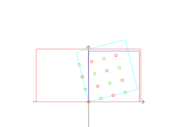
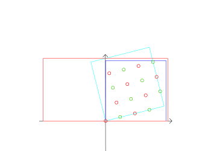
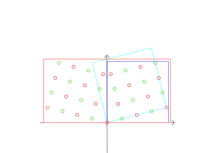
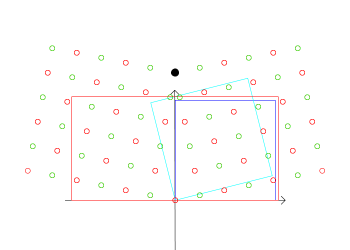
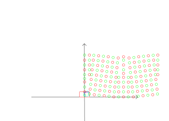

# 【概要】
完全結晶のPOSCARから対称傾角粒界を作成する
# 【使用法】
- 拡張するサイズを整数で指定
- 傾ける角度を4等で指定．arctan(1/4)傾ける
- POSCAR.txtにprocessingが読みやすいcsv形式で出力
- 出力結果やその経過を視覚化した図が[こちら](BoundaryModel)にある．

```tcsh
bob% pwd
/Users/bob/MultiScaleModeling/2014/mk_boundary
[bob-no-MacBook-Pro:~/MultiScaleModeling/2014/mk_boundary] bob% ruby mk_boundary.rb 3 3 3 4
[3]
[3, 3]
[3, 3, 3]
0.244978663126864
(Al)4  (Fm-3m) 
1.000000
1.000000 0.000000 0.000000
0.000000 1.000000 0.000000
0.000000 0.000000 1.000000
4
Direct
0.000000 0.000000 0.000000
0.000000 0.500000 0.500000
0.500000 0.000000 0.500000
0.500000 0.500000 0.000000
0.25
3.09232921921325
[[3.09232921921325, 0.0, 0.0], [0.0, 3.09232921921325, 0.0], [0.0, 0.0, 3.0]]
[bob-no-MacBook-Pro:~/MultiScaleModeling/2014/mk_boundary] bob% ls -lat
total 72
-rw-r--r--@  1 bob  501  5944 11 20 09:30 POSCAR.txt
drwxr-xr-x  10 bob  501   340 11 19 21:18 ./
...
```

# 【それぞれの操作とその視覚化モデル】

## extend

||元々のPOSCARをxyz方向に222で拡張した時のモデル．z座標の高低によって原子の色を変えて表示している．z軸方向には原子が２個重なっており，全系は32原子からなる．|
|:----|:----|

## rotation

||1/4回転させたモデル．青色の表示の矩形から，水色表示の矩形に全系を傾けた．POSCARの表記では基底ベクトルを回転させるだけで，原子の相対座標は変更していない．|
|:----|:----|

## translation

||x軸の負の位置にある原子をユニットセルの反対側に移動したモデル．|
|:----|:----|

## mk_mirror

||zy平面で鏡面操作し，加えたモデル．重複原子を取り去り，ありそうな原子を追加した後の粒界モデル．周期的にy軸方向に延ばした原子のz座標が元の高さに戻っていない．2224として1/4などの偶数で作ったモデルはすべてこうなる．|
|:----|:----|

## 3335

||3335で生成したモデル．2224のミラーモデルで発生していた周期性の破綻は回避している．しかし，あいかわらず黒丸で塗りつぶしたy軸上の２番目の原子近傍では同色の原子が近接している．すなわち同じ高さにある原子が近接した状態となりエネルギーが高くなることが予測される．|
|:----|:----|

## murakami

||村上がSutton-Vitekの90度近辺モデルのBuffer layerの構造を参考にして作成したモデル．上述の近接原子のジレンマが解消されている．しかし，発見的な方法であるため，多数の試行錯誤を繰り返す作業が必要である．|
|:----|:----|


# 【モデル作成時の注意点】
- y軸は奇数周期でないともとの周期に戻らない，
  - 最後の入力の回転指定は，奇数であるべし．
- 上述操作で回転すると，x軸によぶんな原子一列がくっついていてそれを取る必要がある．
